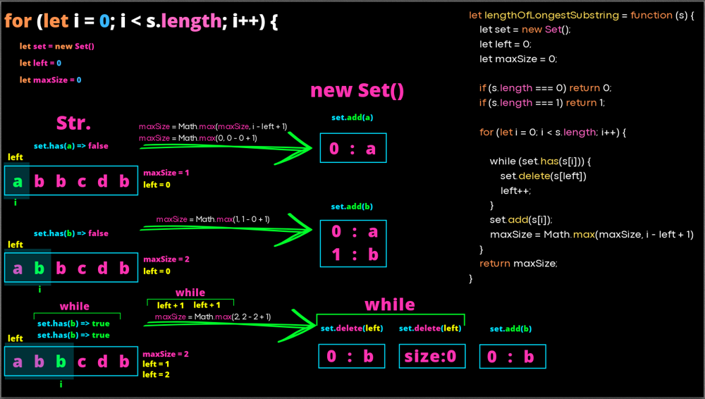

# 3. Longest Substring Without Repeating Characters

Medium
Topics
Companies
Hint
Given a string s, find the length of the longest
substring
 without repeating characters.

Example 1:

Input: s = "abcabcbb"
Output: 3
Explanation: The answer is "abc", with the length of 3.
Example 2:

Input: s = "bbbbb"
Output: 1
Explanation: The answer is "b", with the length of 1.
Example 3:

Input: s = "pwwkew"
Output: 3
Explanation: The answer is "wke", with the length of 3.
Notice that the answer must be a substring, "pwke" is a subsequence and not a substring.

Constraints:

0 <= s.length <= 5 * 104
s consists of English letters, digits, symbols and spaces.

